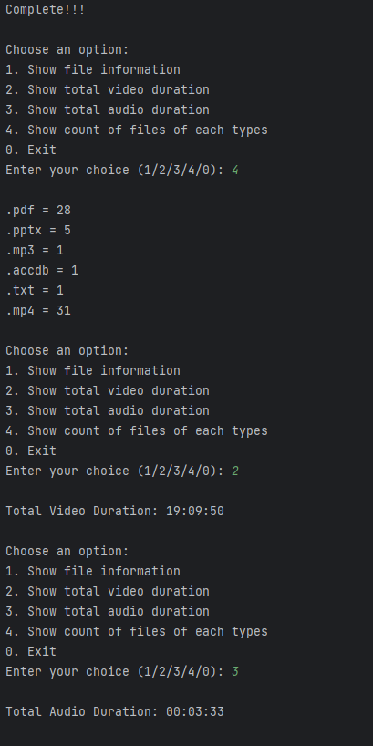

# File Details and Playlist Duration Checker

This Python script allows you to easily retrieve details of files within a local folder and its subfolders. Additionally, if there are any video files in your folder, it helps you find the duration of a playlist. This can be especially useful when you want to know the total duration of a course or a series of videos.

Please note that the processing time of the script will depend on the total number of files and their sizes in the specified folder.

## Installation

Before you can use this script, you'll need to install a few Python libraries if they are not already installed. You can do this by running the following commands in your terminal:

```bash
pip install moviepy
pip install opencv-python
pip install pydub
```
Additionally, for audio file support, you need to install **FFmpeg** and add its path to your computer. You can follow this [tutorial](https://www.youtube.com/watch?v=IECI72XEox0&ab_channel=TroubleChute) for guidance on installing FFmpeg.

## Usage

To use this script, follow these steps:

    1. Clone this repository to your local machine or download the script directly.

    2. Open a terminal window and navigate to the directory where the script is located.

    3. Run the script by executing the following command:

**Note:** When providing the path in the script (lines 11 and 17), make sure to follow this format: `"C:/your/path/like this format"`. This will ensure that the script correctly identifies the folder you want to analyze.

## Sample Output



Make sure to replace the paths in the script with the format you use on your system. This will ensure that the script correctly identifies the folder you want to analyze.

Feel free to contribute to the project or suggest improvements by creating issues or pull requests. Happy file analysis!
